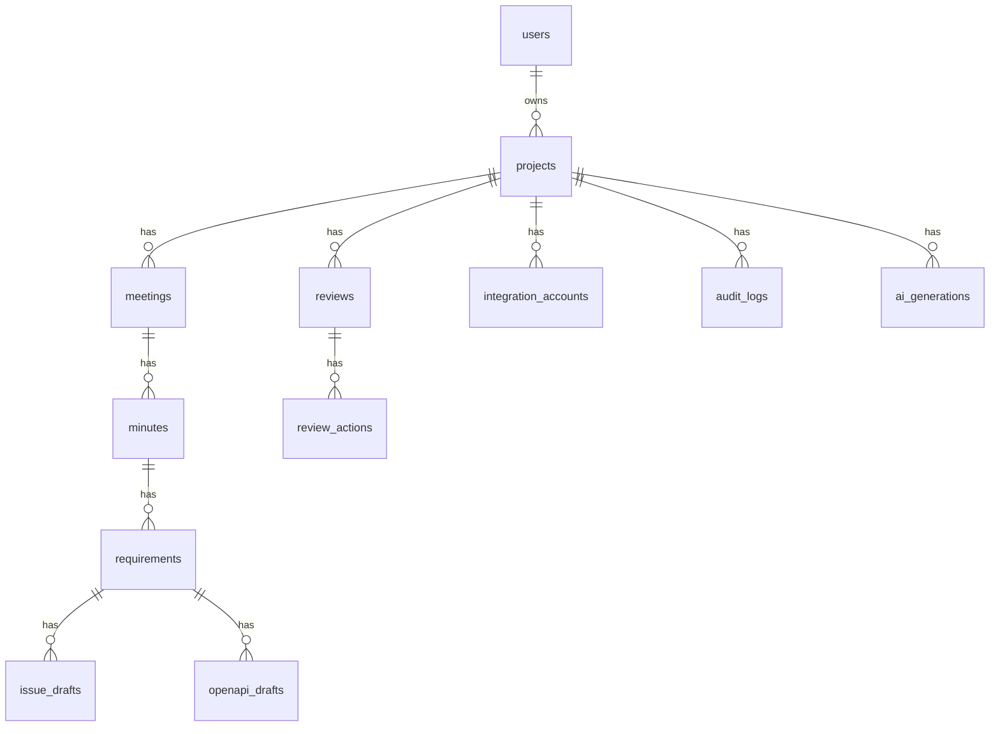

# 2026-06-30 DB設計初稿

## 対象Issue

- ISSUE-002
- ISSUE-003
- ISSUE-004
- ISSUE-005
- ISSUE-006

## 方針

MVPはRails APIとPostgreSQLを前提に、ActiveRecordで扱いやすい正規化されたスキーマから始める。

生成物はすべて監査対象であり、AI出力、ユーザー編集、レビュー、承認、外部同期を追跡できるようにする。

## ERD概要



## テーブル

### users

MVPでは単一ユーザーでも、将来のチーム対応に備えてユーザーを分離する。

| column | type | required | note |
| --- | --- | --- | --- |
| id | uuid | yes | primary key |
| email | string | yes | unique |
| name | string | no | display name |
| role | string | yes | owner, member |
| created_at | datetime | yes |  |
| updated_at | datetime | yes |  |

indexes:

- unique email

### projects

| column | type | required | note |
| --- | --- | --- | --- |
| id | uuid | yes | primary key |
| owner_id | uuid | yes | users.id |
| name | string | yes |  |
| description | text | no |  |
| status | string | yes | active, archived |
| github_repo | string | no | owner/repo |
| created_at | datetime | yes |  |
| updated_at | datetime | yes |  |

indexes:

- owner_id
- status

### meetings

| column | type | required | note |
| --- | --- | --- | --- |
| id | uuid | yes | primary key |
| project_id | uuid | yes | projects.id |
| title | string | yes |  |
| source_type | string | yes | manual, discord_log, transcript |
| meeting_date | date | no |  |
| participants | jsonb | yes | array of names |
| raw_text | text | yes | original log |
| tags | jsonb | yes | array |
| status | string | yes | draft, generated, approved, failed |
| created_by_id | uuid | no | users.id |
| created_at | datetime | yes |  |
| updated_at | datetime | yes |  |

indexes:

- project_id
- source_type
- meeting_date
- status

### minutes

| column | type | required | note |
| --- | --- | --- | --- |
| id | uuid | yes | primary key |
| meeting_id | uuid | yes | meetings.id |
| status | string | yes | draft, generating, generated, in_review, needs_changes, approved, failed |
| summary | text | yes |  |
| decisions | jsonb | yes | structured decisions |
| open_questions | jsonb | yes | array |
| action_items | jsonb | yes | structured actions |
| generated_by_model | string | no |  |
| approved_by_id | uuid | no | users.id |
| approved_at | datetime | no |  |
| created_at | datetime | yes |  |
| updated_at | datetime | yes |  |

indexes:

- meeting_id
- status
- approved_at

### requirements

| column | type | required | note |
| --- | --- | --- | --- |
| id | uuid | yes | primary key |
| minutes_id | uuid | yes | minutes.id |
| status | string | yes | draft, generated, in_review, needs_changes, approved, failed |
| background | text | yes |  |
| goal | text | yes |  |
| user_stories | jsonb | yes | array |
| functional_requirements | jsonb | yes | array |
| non_functional_requirements | jsonb | yes | array |
| acceptance_criteria | jsonb | yes | array |
| out_of_scope | jsonb | yes | array |
| open_questions | jsonb | yes | array |
| risks | jsonb | yes | array |
| generated_by_model | string | no |  |
| approved_by_id | uuid | no | users.id |
| approved_at | datetime | no |  |
| created_at | datetime | yes |  |
| updated_at | datetime | yes |  |

indexes:

- minutes_id
- status

### issue_drafts

| column | type | required | note |
| --- | --- | --- | --- |
| id | uuid | yes | primary key |
| requirement_id | uuid | yes | requirements.id |
| status | string | yes | draft, in_review, needs_changes, approved, publishing, published, publish_failed |
| title | string | yes |  |
| body | text | yes | GitHub markdown |
| acceptance_criteria | jsonb | yes | array |
| labels | jsonb | yes | array |
| assignees | jsonb | yes | array |
| milestone | string | no |  |
| github_issue_number | integer | no |  |
| github_issue_url | string | no |  |
| publish_error | text | no |  |
| approved_by_id | uuid | no | users.id |
| approved_at | datetime | no |  |
| published_at | datetime | no |  |
| created_at | datetime | yes |  |
| updated_at | datetime | yes |  |

indexes:

- requirement_id
- status
- github_issue_number

### openapi_drafts

| column | type | required | note |
| --- | --- | --- | --- |
| id | uuid | yes | primary key |
| requirement_id | uuid | yes | requirements.id |
| status | string | yes | draft, invalid, valid, in_review, needs_changes, approved |
| title | string | yes |  |
| content | text | yes | OpenAPI YAML |
| validation_errors | jsonb | yes | array |
| generated_by_model | string | no |  |
| approved_by_id | uuid | no | users.id |
| approved_at | datetime | no |  |
| created_at | datetime | yes |  |
| updated_at | datetime | yes |  |

indexes:

- requirement_id
- status

### reviews

| column | type | required | note |
| --- | --- | --- | --- |
| id | uuid | yes | primary key |
| project_id | uuid | yes | projects.id |
| target_type | string | yes | minutes, requirement, issue_draft, openapi_draft, architecture, security, release |
| target_id | uuid | no | target record id when available |
| status | string | yes | open, action_required, resolved, accepted_risk |
| reviewer_role | string | yes | CTO, QA, Security, etc |
| frameworks | jsonb | yes | array |
| positives | jsonb | yes | array |
| improvements | jsonb | yes | array |
| priority | jsonb | yes | array |
| next_actions | jsonb | yes | array |
| issue_numbers | jsonb | yes | local and GitHub issue refs |
| external_ai_sources | jsonb | yes | Codex, Claude, ChatGPT etc |
| created_by_id | uuid | no | users.id |
| created_at | datetime | yes |  |
| updated_at | datetime | yes |  |

indexes:

- project_id
- target_type, target_id
- status
- reviewer_role

### review_actions

| column | type | required | note |
| --- | --- | --- | --- |
| id | uuid | yes | primary key |
| review_id | uuid | yes | reviews.id |
| description | text | yes |  |
| priority | string | yes | P0, P1, P2 |
| status | string | yes | open, in_progress, resolved, accepted_risk |
| linked_issue_number | string | no | local or GitHub issue |
| resolved_by_id | uuid | no | users.id |
| resolved_at | datetime | no |  |
| created_at | datetime | yes |  |
| updated_at | datetime | yes |  |

indexes:

- review_id
- status
- priority

### integration_accounts

| column | type | required | note |
| --- | --- | --- | --- |
| id | uuid | yes | primary key |
| project_id | uuid | yes | projects.id |
| provider | string | yes | github, discord, notion, google_drive, slack |
| status | string | yes | not_connected, connected, error, revoked |
| external_account_id | string | no |  |
| scopes | jsonb | yes | granted scopes |
| encrypted_access_token | text | no | encrypted |
| encrypted_refresh_token | text | no | encrypted |
| token_expires_at | datetime | no |  |
| last_sync_at | datetime | no |  |
| last_error | text | no |  |
| created_at | datetime | yes |  |
| updated_at | datetime | yes |  |

indexes:

- project_id
- provider
- unique project_id, provider

### ai_generations

| column | type | required | note |
| --- | --- | --- | --- |
| id | uuid | yes | primary key |
| project_id | uuid | yes | projects.id |
| target_type | string | yes | minutes, requirement, issue_draft, openapi_draft, review |
| target_id | uuid | no |  |
| model | string | yes |  |
| prompt_version | string | no |  |
| input_hash | string | yes | raw input hash |
| prompt_snapshot | text | yes |  |
| output_snapshot | text | no |  |
| status | string | yes | queued, running, succeeded, failed |
| error_message | text | no |  |
| started_at | datetime | no |  |
| completed_at | datetime | no |  |
| created_at | datetime | yes |  |
| updated_at | datetime | yes |  |

indexes:

- project_id
- target_type, target_id
- status
- input_hash

### audit_logs

| column | type | required | note |
| --- | --- | --- | --- |
| id | uuid | yes | primary key |
| project_id | uuid | yes | projects.id |
| actor_id | uuid | no | users.id or system |
| action | string | yes |  |
| target_type | string | yes |  |
| target_id | uuid | no |  |
| summary | text | no |  |
| metadata | jsonb | yes | sanitized metadata |
| ip_address | inet | no |  |
| user_agent | string | no |  |
| created_at | datetime | yes |  |

indexes:

- project_id
- actor_id
- action
- target_type, target_id
- created_at

## 状態遷移

### Minutes

```text
draft -> generating -> generated -> in_review -> needs_changes -> in_review -> approved
draft -> generating -> failed
```

### Requirement

```text
draft -> generated -> in_review -> needs_changes -> in_review -> approved
```

### IssueDraft

```text
draft -> in_review -> needs_changes -> in_review -> approved -> publishing -> published
approved -> publishing -> publish_failed -> publishing
```

### OpenApiDraft

```text
draft -> invalid -> valid -> in_review -> needs_changes -> valid -> approved
```

## 監査方針

以下の操作は必ずaudit_logsへ記録する。

- 会議ログ登録
- AI生成開始、成功、失敗
- 生成物編集
- レビュー作成
- レビューアクション解決
- 承認
- GitHub公開
- Integration接続、切断、エラー

## データ保持

MVPではプロジェクト単位の削除をサポートする。将来は会議単位、生成物単位の保持期間設定を追加する。

初期保持方針:

- raw_textは明示削除まで保持
- ai_generationsは監査目的で保持
- integration tokenは切断時に削除
- audit_logsは削除対象を最小化し、必要なら匿名化する

## 未決事項

- チームと組織のテーブルをMVPに含めるか
- 生成物の全文履歴を別テーブルで保持するか
- reviews.target_idをuuid固定にするか、polymorphicで扱うか
- GitHub Appを採用する場合のinstallation_id保存先
- secret scanning結果の保存モデル

