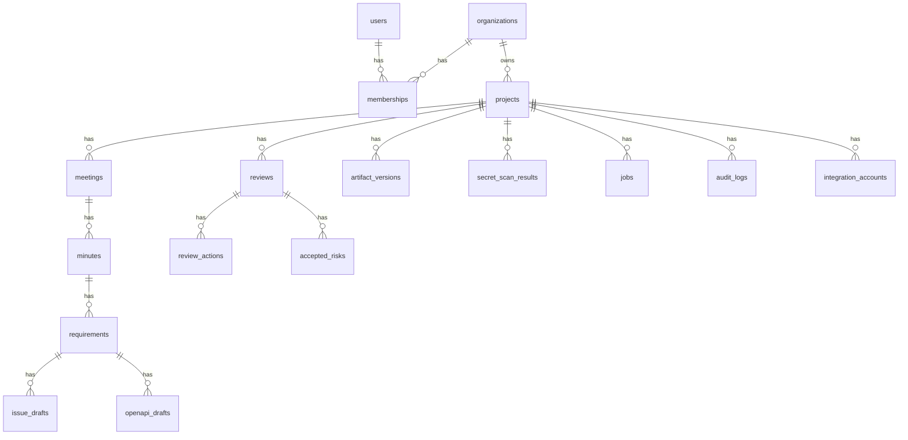

# 2026-06-30 DB設計強化

## 対象Issue

- ISSUE-008: 実装前にAPI/DB設計を強化する

## 目的

DB初稿で未決だった、組織、メンバーシップ、artifact version、secret scan、accepted risk、job、エラーマスキング、暗号化方針を実装前に決める。

## 採用判断

| 項目 | 判断 | 理由 |
| --- | --- | --- |
| organizations | 採用 | 将来チーム利用が前提であり、後付けすると権限と監査ログの移行が重い |
| memberships | 採用 | owner/member/reviewerの権限を最小限でも分ける必要がある |
| artifact_versions | 採用 | AI生成物と人間編集の差分監査がプロダクト価値の中核 |
| secret_scan_results | 採用 | 会議ログやIssue本文をAI/GitHubへ送る前の安全性に必須 |
| jobs | 採用 | AI生成、GitHub公開、validationを非同期追跡するため |
| accepted_risks | 採用 | レビューゲートを運用可能にしつつ、例外を監査するため |
| raw_text encryption | 採用 | 会議ログは機密性が高く、平文保存リスクが大きい |

## 更新ERD概要

## 追加テーブル

### organizations

| column | type | required | note |
| --- | --- | --- | --- |
| id | uuid | yes | primary key |
| name | string | yes |  |
| slug | string | yes | unique |
| status | string | yes | active, suspended |
| created_at | datetime | yes |  |
| updated_at | datetime | yes |  |

indexes:

- unique slug
- status

### memberships

| column | type | required | note |
| --- | --- | --- | --- |
| id | uuid | yes | primary key |
| organization_id | uuid | yes | organizations.id |
| user_id | uuid | yes | users.id |
| role | string | yes | owner, admin, member, reviewer |
| status | string | yes | active, invited, disabled |
| created_at | datetime | yes |  |
| updated_at | datetime | yes |  |

indexes:

- unique organization_id, user_id
- role
- status

### artifact_versions

生成物のAI生成、手動編集、承認前差分を記録する。

| column | type | required | note |
| --- | --- | --- | --- |
| id | uuid | yes | primary key |
| project_id | uuid | yes | projects.id |
| artifact_type | string | yes | meeting, minutes, requirement, issue_draft, openapi_draft |
| artifact_id | uuid | yes |  |
| version_number | integer | yes | artifact単位で連番 |
| change_source | string | yes | ai, user, system |
| changed_by_id | uuid | no | users.id |
| summary | text | no |  |
| snapshot | jsonb | yes | sanitized artifact snapshot |
| snapshot_hash | string | yes | tamper detection |
| created_at | datetime | yes |  |

indexes:

- project_id
- artifact_type, artifact_id, version_number
- snapshot_hash

### secret_scan_results

AI送信、GitHub publish、export前の秘密情報検出結果を保存する。

| column | type | required | note |
| --- | --- | --- | --- |
| id | uuid | yes | primary key |
| project_id | uuid | yes | projects.id |
| target_type | string | yes | meeting, minutes, requirement, issue_draft, openapi_draft |
| target_id | uuid | yes |  |
| status | string | yes | clear, warning, blocked |
| detector | string | yes | built_in, external |
| findings | jsonb | yes | redacted findings |
| raw_finding_count | integer | yes |  |
| scanned_at | datetime | yes |  |
| created_at | datetime | yes |  |

indexes:

- project_id
- target_type, target_id
- status
- scanned_at

### jobs

非同期処理の状態を保存する。

| column | type | required | note |
| --- | --- | --- | --- |
| id | uuid | yes | primary key |
| project_id | uuid | yes | projects.id |
| job_type | string | yes | ai_generation, github_publish, github_connect, validation |
| status | string | yes | queued, running, succeeded, failed, cancelled |
| target_type | string | yes |  |
| target_id | uuid | no |  |
| progress | integer | no | 0-100 |
| idempotency_key | string | no |  |
| error_code | string | no |  |
| safe_error_detail | text | no | UI-safe detail |
| internal_error_ref | string | no | log correlation id |
| started_at | datetime | no |  |
| completed_at | datetime | no |  |
| created_at | datetime | yes |  |
| updated_at | datetime | yes |  |

indexes:

- project_id
- status
- job_type
- target_type, target_id
- unique idempotency_key where not null

### accepted_risks

レビューゲートの例外承認を監査する。

| column | type | required | note |
| --- | --- | --- | --- |
| id | uuid | yes | primary key |
| review_id | uuid | yes | reviews.id |
| reason | text | yes |  |
| residual_risk | text | yes |  |
| approved_by_id | uuid | yes | users.id |
| expires_at | datetime | yes |  |
| linked_issue_number | string | yes | local or GitHub |
| status | string | yes | active, expired, revoked |
| accepted_at | datetime | yes |  |
| revoked_at | datetime | no |  |
| created_at | datetime | yes |  |
| updated_at | datetime | yes |  |

indexes:

- review_id
- approved_by_id
- status
- expires_at

## 既存テーブル変更

### projects

追加:

- organization_id uuid required

変更:

- owner_idは個人所有MVP用ではなく、created_by_idへ変更する。所有権はorganization/membershipで管理する。

### meetings

変更:

- raw_textは暗号化対象にする。
- 検索用に `raw_text_sha256` を追加する。
- UI表示用の短い `redacted_preview` を追加する。

### reviews

追加:

- blocking_level: none, warning, hard_block
- accepted_risk_allowed boolean

Security P0 blockerの場合、`accepted_risk_allowed` はfalse。

### audit_logs

追加:

- organization_id
- request_id
- safe_metadata

禁止:

- token
- secret
- raw transcript全文
- prompt全文
- AI output全文

全文はartifact_versionsまたはai_generationsに保存し、必要な権限でのみ参照する。

## 暗号化方針

### 暗号化対象

- meetings.raw_text
- minutes.summary
- requirements本文系カラム
- issue_drafts.body
- openapi_drafts.content
- ai_generations.prompt_snapshot
- ai_generations.output_snapshot
- integration tokens

### 方針

Rails採用時はActiveRecord Encryptionを第一候補にする。検索が必要な項目は全文ではなくhash、redacted preview、構造化メタデータを別に持つ。

## エラーマスキング方針

UI/APIへ返すのは `safe_error_detail` のみ。

保存禁止:

- access token
- refresh token
- OAuth code
- raw prompt
- raw transcript
- Authorization header
- cookie

内部ログ参照は `internal_error_ref` で紐付ける。

## 実装前に必要なADR

- GitHub App vs OAuth App
- ActiveRecord Encryption採用
- artifact_versions snapshot粒度
- accepted_risk権限

## 未解決

- secret scan detectorを内製にするか外部ライブラリにするか
- artifact_versionsのsnapshotをjsonbとtextどちらで持つか
- audit_logsの保持期間
- organization招待フロー

