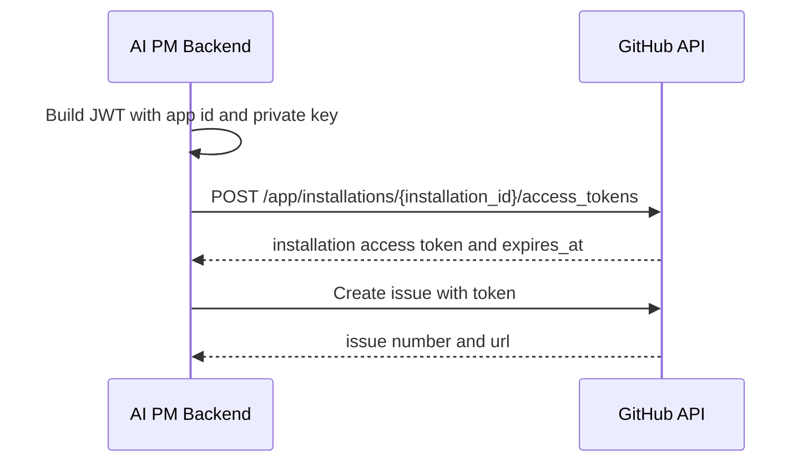

# 2026-06-30 GitHub App実装準備

## 対象Issue

- ISSUE-012: GitHub App実装準備を行う

## 前提

MVPのGitHub連携はGitHub Appを採用する。

関連:

- `docs/decisions/ADR-0003_github_integration_app_over_oauth.md`
- `docs/security/20260630_github_integration_security_design.md`

## GitHub App作成手順

1. GitHub Developer settingsでNew GitHub Appを作成する。
2. App nameを設定する。
3. Homepage URLを設定する。
4. Callback URLを設定する。
5. Webhook URLを設定する。
6. Webhook secretを生成して設定する。
7. Repository permissionsを設定する。
8. Subscribe to eventsを設定する。
9. Private keyを生成する。
10. App ID、Client ID、Client Secret、Private Keyを環境変数へ設定する。
11. Appを対象リポジトリへinstallする。

## URL

MVP local:

- Callback URL: `http://localhost:3001/api/v1/integrations/github/callback`
- Webhook URL: `http://localhost:3001/api/v1/webhooks/github`

Production placeholder:

- Callback URL: `https://api.example.com/api/v1/integrations/github/callback`
- Webhook URL: `https://api.example.com/api/v1/webhooks/github`

## GitHub App permissions

Required:

| Permission | Level | Purpose |
| --- | --- | --- |
| Metadata | Read-only | Required by GitHub App |
| Issues | Read and write | Create approved GitHub Issues |

Not requested in MVP:

- Contents
- Pull requests
- Actions
- Checks
- Administration
- Secrets
- Members

## Webhook events

MVPで購読する。

- Installation
- Installation repositories

MVPでは購読しない。

- Issues
- Pull request
- Push
- Check suite
- Workflow run

Issue作成結果はREST API responseで保存するため、Issues webhookは初期MVPでは不要。

## 環境変数

| Name | Required | Secret | Description |
| --- | --- | --- | --- |
| GITHUB_APP_ID | yes | no | GitHub App ID |
| GITHUB_APP_CLIENT_ID | yes | no | GitHub App client ID |
| GITHUB_APP_CLIENT_SECRET | yes | yes | OAuth callback検証用 |
| GITHUB_APP_PRIVATE_KEY | yes | yes | PEM private key |
| GITHUB_APP_WEBHOOK_SECRET | yes | yes | webhook署名検証 |
| GITHUB_APP_CALLBACK_URL | yes | no | callback URL |
| GITHUB_APP_WEBHOOK_URL | yes | no | webhook URL |
| GITHUB_APP_INSTALL_URL | yes | no | installation URL |

## private key方針

- private keyは環境変数またはsecret managerに保存する。
- repositoryへコミットしない。
- ログへ出さない。
- 起動時にformat検証だけ行う。
- rotation時は新旧keyを短期間併用できる設計にする。

## installation access token flow

## token cache policy

MVP:

- installation access tokenは原則オンデマンド生成する。
- キャッシュする場合はメモリまたは暗号化DBに保存する。
- expires_atの5分前に期限切れ扱いにする。
- tokenをaudit_logs、safe_error_detail、job errorへ保存しない。

Production:

- secret managerまたは暗号化DBを使う。
- key rotationとtoken invalidationを運用手順化する。

## DB制約

### integration_accounts

追加推奨:

- github_installation_id string
- repository_owner string
- repository_name string
- github_account_login string
- github_account_type string
- permissions jsonb
- token_expires_at datetime

index:

- unique project_id, provider
- unique github_installation_id, repository_owner, repository_name

### issue_drafts

追加推奨:

- publish_idempotency_key string
- github_repository string
- github_issue_node_id string
- github_issue_api_id integer
- last_publish_attempt_at datetime

index:

- unique publish_idempotency_key where not null
- unique github_issue_url where not null

## publish idempotency

GitHub Issue作成は外部API呼び出しなので、二重作成を防ぐ。

1. publish開始時に `publish_idempotency_key` を保存する。
2. 同じkeyのpublish要求が来た場合、既存のjobまたはpublished issueを返す。
3. GitHub API成功後、issue number、URL、node id、api idを保存する。
4. API成功後のDB保存失敗に備え、retry時はidempotency keyとローカル状態を優先する。

## retry/backoff

| Failure | Retry | Backoff |
| --- | --- | --- |
| 401 token expired | yes | token再生成後に即時1回 |
| 403 permission denied | no | user action required |
| 404 repo not found | no | reconnect required |
| 422 validation failed | no | issue draft修正 |
| 429/rate limit | yes | Retry-Afterまたは指数backoff |
| 5xx | yes | exponential backoff with jitter |

最大retry:

- token expired: 1
- rate limit: 3
- 5xx: 3

## webhook processing

1. `X-Hub-Signature-256` を検証する。
2. 検証失敗ならpayloadを保存せず401。
3. delivery idで冪等性を確認する。
4. installation/repository変更をintegration_accountsへ反映する。
5. audit_logsへsafe_metadataを保存する。

## API追加検討

既存:

- `POST /projects/{project_id}/integrations/github/connect`
- `POST /projects/{project_id}/integrations/github/disconnect`
- `POST /integrations/github/callback`

追加候補:

- `POST /webhooks/github`
- `GET /projects/{project_id}/integrations/github/repositories`
- `POST /projects/{project_id}/integrations/github/test`

## 実装順序

1. 環境変数と設定読み込み
2. GitHub App JWT生成
3. installation token生成
4. GitHub connect callback保存
5. issue publish service
6. idempotency guard
7. webhook signature verification
8. disconnect flow
9. audit log
10. request specとintegration spec

## テスト方針

- JWT生成単体テスト
- installation token request mock
- issue publish success
- issue publish duplicate idempotency
- permission denied
- token expired retry
- webhook signature valid
- webhook signature invalid
- disconnect clears token/cache
- audit log is written without secrets

## 未解決

- GitHub API client library
- local開発でwebhookを受ける方法
- private key rotation UI
- GitHub App manifestを使うか手動設定にするか

