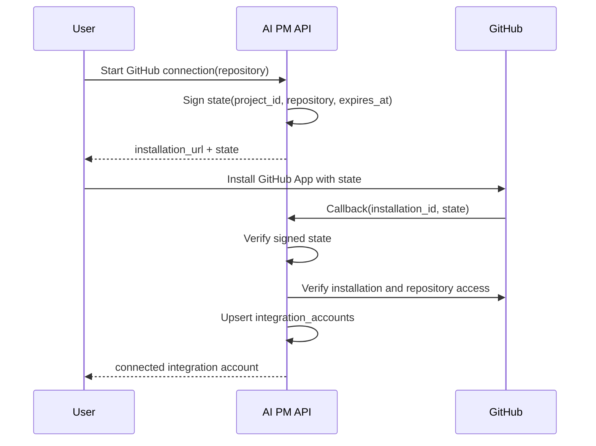

# 2026-07-01 GitHub App Provider実装メモ

## 対象Issue

- ISSUE-004: 要件からGitHub IssueとOpenAPIドラフトを生成する

## 実装目的

承認済みIssue DraftをGitHub Issueとして公開するために、GitHub App installation access tokenを使うproviderを追加する。

## 構成

- `IntegrationAccount`
  - Project単位でGitHub App installationとrepositoryの接続状態を保存する。
  - 保存する情報はinstallation id、repository、account login/type、granted permissions、safe error、last syncのみ。
  - installation access tokenは保存しない。
- `GithubIssuePublish::GithubAppProvider`
  - GitHub App JWTをRS256で生成する。
  - installation access tokenを都度発行する。
  - `POST /repos/{owner}/{repo}/issues` でGitHub Issueを作成する。
  - raw token、private key、raw GitHub response全文は保存しない。
- `GithubIssuePublish::HttpClient`
  - GitHub REST API呼び出しを薄く分離し、RSpecではfake clientに差し替える。
- `GithubIntegration::ConnectionState`
  - Project、repository、expiryをRails署名付きstateとして発行する。
  - callback時にstateを検証し、リクエスト本文でrepositoryを差し替えられないようにする。
- `GithubIntegration::InstallationVerifier`
  - GitHub App JWTで `GET /app/installations/{installation_id}` を呼び、installation実在と権限を確認する。
  - installation access tokenを都度発行し、`GET /installation/repositories` で対象repositoryへのアクセスを確認する。
  - callback本文の `granted_permissions` は信頼せず、GitHub APIから取得したpermissionsを保存する。
- `IntegrationAccountsController`
  - `GET /projects/{project_id}/integrations`
  - `POST /projects/{project_id}/integrations/github/connect`
  - `POST /integrations/github/callback`
  - `POST /projects/{project_id}/integrations/github/disconnect`

## Provider選択

標準は安全停止。

```bash
GITHUB_ISSUE_PUBLISH_PROVIDER=github_app
```

を明示した場合のみGitHub App providerを使う。

必要な環境変数:

- `GITHUB_APP_ID`
- `GITHUB_APP_PRIVATE_KEY` または `GITHUB_APP_PRIVATE_KEY_BASE64`
- `GITHUB_API_BASE_URL` 任意。未指定時は `https://api.github.com`

## 公開前提

- Issue Draft status is `approved`
- 最新OpenAPI Draft status is `valid` or `approved`
- OpenAPI Validatorの未解決 `action_required` reviewがない
- Project `github_repo` が `owner/repo` 形式
- Projectに対象repositoryのconnected `integration_accounts` がある
- `granted_permissions["issues"] == "write"`

## GitHub接続flow



## 失敗時の扱い

- 未接続: `github_integration_not_connected`
- GitHub App未設定: `github_app_not_configured`
- 権限不足: `github_permission_missing`
- installation token作成失敗: `github_installation_token_failed`
- Issue作成失敗: `github_issue_create_failed`

いずれもsafe errorのみをAPI/DBへ残す。

## セキュリティ上の注意

- installation access tokenは永続保存しない。
- private keyは環境変数から読み、DBへ保存しない。
- GitHub Issue本文の監査markerにはIdempotency-Keyの生値を入れず、SHA-256 digestの短縮値のみを入れる。
- GitHub App権限はMetadata read、Issues writeに限定する。

## 残課題

- 実GitHub App credentialを使ったstaging/live publish検証を行う。
- 外部API成功後、DB保存前に障害が起きた場合のreconciliationを設計する。
- GitHub webhook署名検証とinstallation revoked/permissions changed同期を追加する。
- GitHub App callbackがGitHubから受け取る実payloadとの差分をstaging smokeで確認する。
- callback state replayを防ぐnonce保存を追加する。
