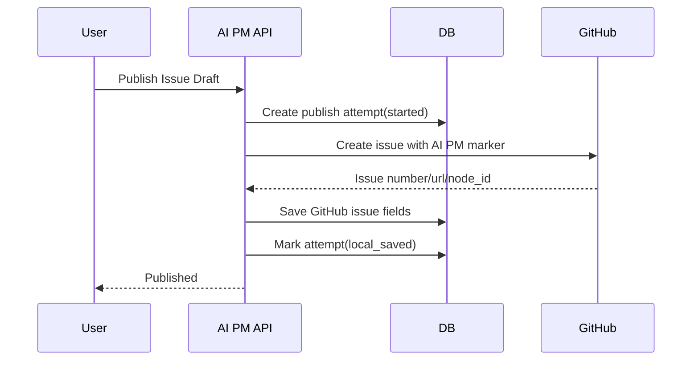
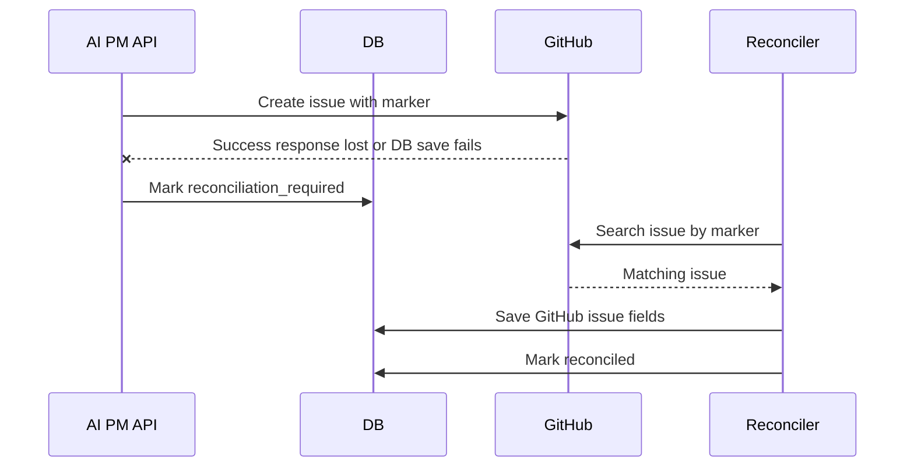

# ADR-0006: GitHub Issue公開のreconciliation方針

## Status

Accepted

## Date

2026-07-01

## Context

AI PM Platformは、承認済みIssue DraftをGitHub Issueとして公開する。現在の実装では、GitHub APIでIssue作成に成功した後、ローカルDBへ `github_issue_number`、`github_issue_url`、`github_issue_node_id` を保存する。

問題は、GitHub API成功後からDB保存完了までの間に、DB障害、process crash、timeout、network切断が発生した場合である。この場合、GitHubにはIssueが存在するのにローカルでは未公開または失敗扱いになり、単純なretryで二重Issueを作る危険がある。

GitHub Issue作成APIは、AI PM Platform側の業務idempotency keyをそのまま外部idempotencyとして保証するものではない。そのため、本プロダクト側でreconciliation境界を設計する必要がある。

## Decision

GitHub Issue publishは、以下の方針で実装・拡張する。

1. GitHub Issue本文にAI PM markerを必ず埋め込む。
2. markerには `issue_draft_id` と `idempotency_digest` を入れる。
3. `Idempotency-Key` の生値はGitHub Issue本文、AuditLog、Job、safe errorへ保存しない。
4. GitHub API成功後のDB保存失敗、またはGitHub APIの成功/失敗が不明なtimeoutは、自動再作成せずreconciliation対象にする。
5. reconciliationでは対象repository内のGitHub Issueをmarkerで検索し、1件に特定できた場合のみローカル台帳へ紐付ける。
6. 0件または複数件の場合は `publish_reconciliation_required` として人間レビューに止める。
7. reconnectやretryでも、既存markerが見つかった場合は新規Issueを作らず既存Issueへ紐付ける。

## Required Marker

GitHub Issue本文には以下の形式を含める。

```text
<!-- ai_pm_platform:issue_draft_id={uuid};idempotency_digest={sha256_16} -->
```

保存する:

- `issue_draft_id`
- `idempotency_digest`
- `github_repository`
- `github_issue_number`
- `github_issue_url`
- `github_issue_api_id`
- `github_issue_node_id`
- `last_publish_attempt_at`
- safe error

保存しない:

- Idempotency-Keyの生値
- installation access token
- GitHub raw response全文
- GitHub authorization header

## Future Data Model

今後の実装では、`issue_drafts` の状態だけでなく、publish attemptを別テーブルとして保存する。

推奨テーブル: `github_issue_publish_attempts`

推奨カラム:

- `issue_draft_id`
- `project_id`
- `github_repository`
- `idempotency_digest`
- `status`
  - `started`
  - `github_created`
  - `local_saved`
  - `failed`
  - `reconciliation_required`
  - `reconciled`
- `github_issue_number`
- `github_issue_url`
- `github_issue_node_id`
- `safe_error_code`
- `safe_error_detail`
- `started_at`
- `github_created_at`
- `completed_at`
- `reconciled_at`

## Publish Flow



## Ambiguous Failure Flow



## Reconciliation Rules

### 1 exact match

If one GitHub Issue contains the marker for `issue_draft_id`, the system links that Issue to the local Issue Draft and marks publish as reconciled.

### 0 matches

The system keeps the draft in `publish_failed` or future `publish_reconciliation_required` state. It does not create a new Issue automatically until a human confirms retry.

### Multiple matches

The system stops and requires human review. It must not choose one automatically.

### Existing local URL

If `github_issue_url` is already present, publish returns the existing published result and does not call GitHub create again.

### GitHub permission or installation errors

Permission, revoked installation, repository mismatch, and missing Issues write permission are not reconciliation candidates. They remain integration failures.

## Failure Classification

| Failure | Reconciliation? | Action |
| --- | --- | --- |
| GitHub returns 201 and DB save fails | Yes | Search by marker, link exact match |
| Network timeout after request sent | Yes | Search by marker before retry |
| GitHub 4xx validation error | No | Mark publish_failed |
| GitHub 401/403 installation/permission error | No | Mark integration error |
| GitHub 5xx before known create | Maybe | Search by marker, require review if unclear |
| Local validation/gate failure | No | Do not call GitHub |

## Security

- Idempotency-Key生値は保存しない。
- markerは秘密ではない。外部公開されても問題ない識別子と短縮digestだけを入れる。
- reconciliation search結果のraw bodyは保存しない。
- GitHub Issue本文に会議原文やsecret-like contentが含まれる場合はpublish gate前にsecret scanで止める。
- 人間レビューが必要な曖昧状態は、AuditLogとReviewに残す。

## Consequences

### Positive

- 二重GitHub Issue作成リスクを下げられる。
- process crashやDB障害後も復旧可能になる。
- GitHub側をsource of truthにしすぎず、AI PM Platformの監査台帳も維持できる。
- Idempotency-Keyの漏洩を避けられる。

### Negative

- publish attempt tableとreconcilerが必要になり実装が増える。
- GitHub searchの遅延、indexing delay、rate limitを考慮する必要がある。
- markerが手動編集で削除された場合、reconciliation精度が落ちる。
- 曖昧状態では人間レビューが必要になる。

## Alternatives Considered

### Retry create immediately

不採用。

理由:

- GitHub側でIssueが作成済みだった場合に二重Issueを作る。
- AI PMとして監査可能な安全運用に合わない。

### GitHub Issue titleだけで重複判定

不採用。

理由:

- タイトルは人間が編集できる。
- 似たIssueが複数存在する場合に誤検出しやすい。

### ローカルDBだけをsource of truthにする

不採用。

理由:

- DB保存前にGitHub作成が成功した障害を扱えない。

### Idempotency-Keyの生値をGitHub本文に入れる

不採用。

理由:

- 外部Issue本文に内部retry keyを露出する必要がない。
- digestで照合用途は足りる。

## Implementation Follow-up

- [Done 2026-07-01] `github_issue_publish_attempts` migration/model/service接続を追加する。
- [Done 2026-07-01] publish attemptは同じ `issue_draft_id` / `idempotency_digest` でも複数記録し、再試行履歴を監査できるようにする。
- providerでambiguous failureを分類する。
- [Done 2026-07-01] marker検索用のGitHub API clientを追加する。
- [Done 2026-07-01] exact matchなら自動reconcileするserviceを追加する。
- [Done 2026-07-01] 0件/複数件はReview blockerを作成する。
- [Done 2026-07-01] reconciliation結果をAuditLogへ保存する。
- [Done 2026-07-01] reconciler実行job/APIを追加する。
- Review blockerから手動紐付け/controlled retryを実装する。
- Playwrightまたはrequest specで「同じdraftを二重publishしない」導線を追加する。
