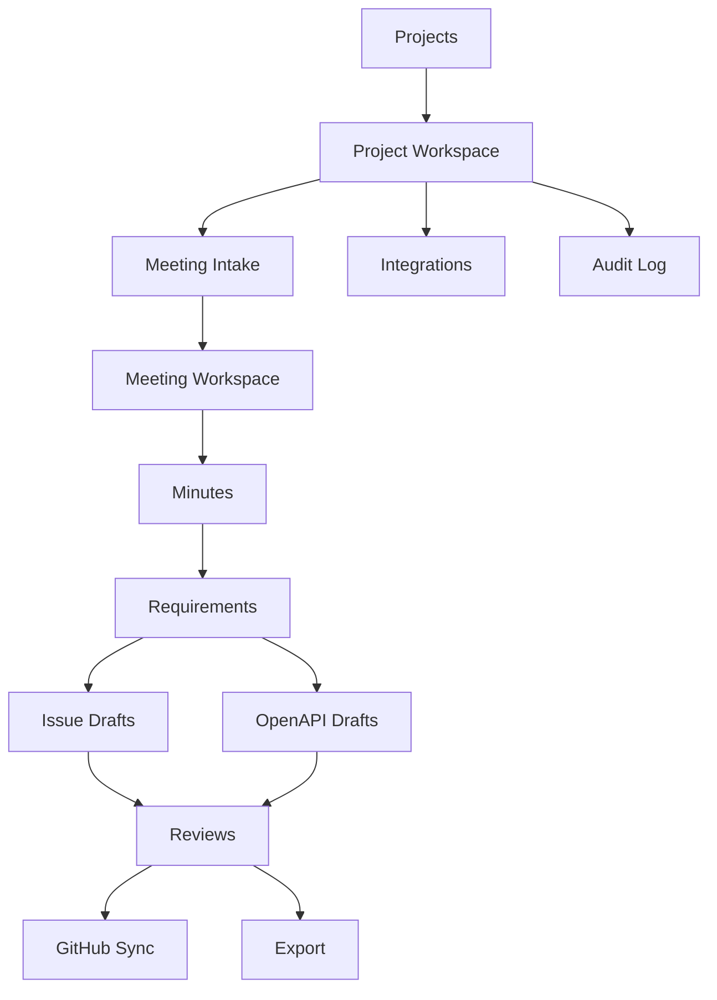
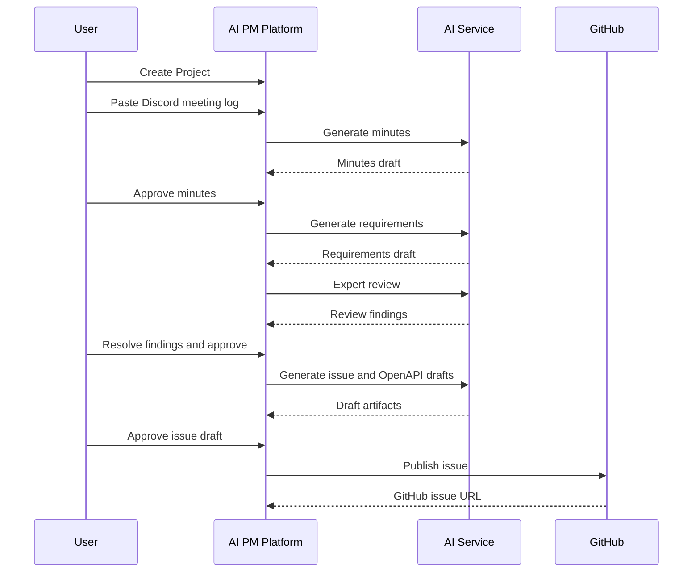

# 2026-06-30 MVP画面設計

## 対象Issue

- ISSUE-002: Discord会議ログを取り込み、議事録生成MVPを作る
- ISSUE-003: 議事録から要件定義ドラフトを生成する
- ISSUE-004: 要件からGitHub IssueとOpenAPIドラフトを生成する
- ISSUE-005: 専門家AIレビューと評価保存パイプラインを作る
- ISSUE-006: OAuth、認証、監査、データ保護の初期設計を作る

## 目的

MVPの画面は、会議ログをAIで処理するだけではなく、生成物を人間が確認し、レビューし、改善し、GitHub IssueやOpenAPIへ進めるための作業台にする。

ユーザーが最初に体験すべき価値は以下である。

```text
会議ログを貼る
-> AI議事録を生成
-> 要件定義を生成
-> Issue案とOpenAPI案を生成
-> 専門家レビューを確認
-> 改善してGitHubへ送る
```

## デザイン原則

1. 作業状態を常に見せる。
2. AI生成物は承認前提にする。
3. 未決事項とリスクを隠さない。
4. レビュー未実施なら次工程へ進めない。
5. 開発者とPMが同じ画面で成果物を確認できる。
6. 初期MVPでは派手なダッシュボードより、生成、編集、レビュー、同期の実務導線を優先する。

## 情報設計



## MVPナビゲーション

左サイドバー:

- Projects
- Meetings
- Requirements
- Issues
- OpenAPI
- Reviews
- Integrations
- Audit Log

上部バー:

- Project selector
- GitHub sync status
- Review gate status
- User/account menu

## 主要画面

### 1. Project一覧

目的:

作業対象プロジェクトを選ぶ。MVPではチーム管理より、個別プロジェクトの作成と再開を優先する。

表示項目:

- Project name
- Last meeting date
- Open review blockers
- Unsynced issue drafts
- GitHub connection status
- Last updated at

主要操作:

- New Project
- Open Project
- Connect GitHub

空状態:

- 最初のプロジェクト作成を促す
- サンプル会議ログの読み込みを提供する

### 2. Project Workspace

目的:

会議、要件、Issue、OpenAPI、レビューの全体状態を俯瞰する。

表示項目:

- Active pipeline
- Latest meeting
- Draft requirements count
- Issue drafts count
- OpenAPI drafts count
- Review blockers
- Recent decisions
- Recent audit events

主要操作:

- Add Meeting
- Generate from latest meeting
- Open review blockers
- Export artifacts

### 3. Meeting Intake

目的:

Discordログまたは会議テキストを登録する。

入力項目:

- Meeting title
- Source type: manual, discord_log, transcript
- Meeting date
- Participants
- Raw transcript or log
- Optional tags

主要操作:

- Save Draft
- Generate Minutes
- Clear

バリデーション:

- title required
- source_type required
- raw_text required
- raw_text max length warning at 10,000 chars
- participant names optional but recommended

重要なUX:

- Discordログ貼り付け時は、発言者、時刻、本文の推定抽出結果をプレビューする。
- 機密情報検出が走る場合は、AI送信前に警告を表示する。

### 4. Meeting Workspace

目的:

会議ログ、議事録、決定事項、未決事項、アクションアイテムを同じ画面で確認する。

レイアウト:

- 左: raw transcript/log
- 中央: AI minutes editor
- 右: decisions, open questions, action items, review status

タブ:

- Transcript
- Minutes
- Decisions
- Actions
- Review

主要操作:

- Generate Minutes
- Regenerate selected section
- Approve Minutes
- Generate Requirements
- Request Review

状態:

- draft
- generating
- generated
- needs_changes
- approved

レビューゲート:

MinutesがapprovedになるまでRequirement生成は警告付きにする。MVPでは完全ブロックではなく、レビュー未完了バナーを出す。

### 5. Requirement Workspace

目的:

議事録から生成された要件定義を編集し、IssueとOpenAPIの入力品質を高める。

表示セクション:

- Background
- Goal
- User stories
- Functional requirements
- Non-functional requirements
- Acceptance criteria
- Out of scope
- Open questions
- Risks

主要操作:

- Generate Requirements
- Edit
- Request Expert Review
- Approve Requirements
- Generate Issue Drafts
- Generate OpenAPI Draft

状態:

- draft
- generated
- in_review
- needs_changes
- approved

重要なUX:

- Open questionsが残っている場合、Issue/OpenAPI生成時に警告する。
- AIが自信を持てない項目は「要確認」として明示する。

### 6. Issue Draft Workspace

目的:

GitHubへ登録する前にIssue案を確認、編集、レビューする。

表示項目:

- Title
- Body
- Background
- Goal
- Acceptance criteria
- Labels
- Assignees
- Milestone
- Related meeting
- Related requirement
- Related reviews
- GitHub sync status

主要操作:

- Generate Issue Draft
- Edit
- Request Review
- Approve
- Publish to GitHub
- Copy Markdown

状態:

- draft
- in_review
- needs_changes
- approved
- publishing
- published
- publish_failed

レビューゲート:

approvedでないIssue DraftはGitHubへpublishできない。

### 7. OpenAPI Draft Workspace

目的:

要件からAPI仕様を作り、Backend/Frontend実装前にレビューする。

表示項目:

- Endpoint list
- Method
- Path
- Request schema
- Response schema
- Error schema
- Security requirement
- Example payload
- OpenAPI YAML preview

主要操作:

- Generate OpenAPI Draft
- Edit YAML
- Validate OpenAPI
- Request API Review
- Approve
- Export openapi.yaml

状態:

- draft
- invalid
- valid
- in_review
- needs_changes
- approved

レビューゲート:

approvedでないOpenAPI DraftからBackend/Frontend実装Issueを作れない。

### 8. Review Center

目的:

各工程のレビュー結果と改善アクションを一覧化する。

表示項目:

- Review target
- Framework
- Reviewer role
- Positive findings
- Improvements
- Priority
- Next actions
- Linked issue
- Status
- Created at

フィルター:

- target type
- status
- priority
- reviewer role
- issue number

主要操作:

- Create Review
- Mark Action Resolved
- Create Follow-up Issue
- Compare AI Reviews

状態:

- open
- action_required
- resolved
- accepted_risk

### 9. Integrations

目的:

GitHub、Discord、Notion、Google Drive、Slackの接続状態を管理する。

MVP対象:

- GitHub
- Discord manual import status

表示項目:

- Provider
- Connection status
- Permission scopes
- Last sync at
- Last error

主要操作:

- Connect GitHub
- Disconnect
- Test Connection
- View required scopes

セキュリティUX:

- 権限の意味を明示する。
- tokenやsecretは表示しない。
- 権限不足時は具体的に不足scopeを出す。

### 10. Audit Log

目的:

生成、編集、レビュー、承認、外部同期の履歴を追跡する。

表示項目:

- Actor
- Action
- Target
- Before/after summary
- Source AI model
- Timestamp
- IP/session metadata

主要操作:

- Filter
- Export
- Open related artifact

## 主要ユーザーフロー

### Flow A: 初回MVP体験



### Flow B: レビューで差し戻す

```text
Generated artifact
-> Request Review
-> Review status: action_required
-> User edits artifact
-> Mark action resolved
-> Request Review again
-> Approve
-> Next phase unlocked
```

## 画面状態とゲート

| Target | Draft | Review Required | Approved | Next unlocked |
| --- | --- | --- | --- | --- |
| Minutes | saved or generated | yes | yes | Requirements |
| Requirements | generated | yes | yes | Issue/OpenAPI |
| Issue Draft | generated | yes | yes | GitHub publish |
| OpenAPI Draft | valid | yes | yes | Backend/Frontend implementation |

## アクセシビリティ要件

- すべての主要操作はキーボードで実行できる。
- AI生成中、保存中、同期中の状態をテキストで示す。
- 成功、警告、エラーを色だけで区別しない。
- Review blockerはバナーとリストの両方で表示する。
- エディタ領域は十分なコントラストを確保する。
- 長文テキストは折り返しと見出しナビゲーションを提供する。

## 初期UIトーン

静かで実務的なSaaS UIにする。AIプロダクトらしい派手さより、PMと開発者が毎日使える信頼感を優先する。

避けるもの:

- 大きすぎるヒーロー
- 装飾的なカードの多用
- 紫系グラデーション中心の単調なAI感
- 生成ボタンだけが目立つUI

採用するもの:

- 密度のある作業台
- 明確な状態ラベル
- 左ナビゲーション
- レビューゲートの固定表示
- 差分と未決事項の強調
- 監査ログへの素早い導線

## MVPで未確定の点

- GitHub連携の方式: OAuth AppかGitHub Appか
- Discord Bot導入時の権限
- 複数AIレビュー比較のUI
- OpenAPI YAML editorの実装方式
- 長文会議ログの分割生成UI

