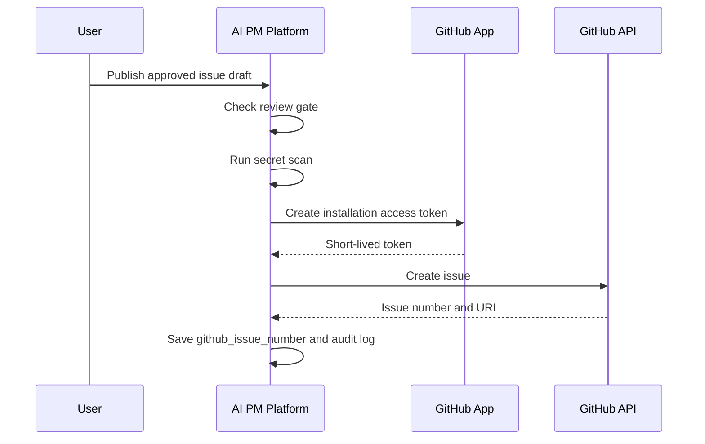

# 2026-06-30 GitHub連携セキュリティ設計

## 対象Issue

- ISSUE-010: GitHub連携方式と権限設計を決定する

## 採用方式

MVPはGitHub Appを採用する。OAuth AppとPersonal Access Tokenは採用しない。

## 権限

### MVP required

| Permission | Level | Purpose |
| --- | --- | --- |
| Metadata | Read-only | GitHub App基本動作に必要 |
| Issues | Read and write | Approved Issue DraftをGitHub Issueとして作成する |

### MVP excluded

- Contents
- Pull requests
- Actions
- Checks
- Administration
- Secrets
- Members

## 保存データ

### integration_accounts

追加または利用する項目:

- provider: github
- status: not_connected, connected, error, revoked
- external_account_id: GitHub App installation id
- scopes: granted permissions
- last_sync_at
- last_error

### 推奨追加項目

`integration_accounts` へ以下の追加を検討する。

- repository_owner
- repository_name
- github_installation_id
- github_account_login
- github_account_type
- webhook_secret_version

## token方針

- installation access tokenは短命tokenとして扱う。
- 原則として永続保存しない。
- キャッシュする場合は暗号化し、expires_atを必須にする。
- tokenをログ、audit_logs、safe_error_detailへ出してはならない。
- token生成失敗時もGitHub raw response全文を保存しない。

## publish flow

## publish guard

公開前に必ず確認する。

- IssueDraft is approved
- Project has active GitHub installation
- Repository matches project github_repo
- No P0 Review blocker
- Secret scan is not blocked
- Idempotency-Key exists
- User has project permission to publish

## failure handling

| Failure | UI/API status | Action |
| --- | --- | --- |
| installation revoked | integration_error | reconnectを促す |
| permission denied | integration_error | required permissionを表示 |
| rate limited | publish_failed | retry afterを表示 |
| duplicate retry | published | existing GitHub issueを返す |
| secret scan blocked | security_warning | publish停止 |
| GitHub API unknown error | publish_failed | safe_error_detailのみ表示 |

## disconnect

Disconnect時:

- integration_accounts.statusをrevokedにする
- token/cacheを削除する
- pending publish jobをcancelまたはfailedにする
- unsynced issue draftsは保持する
- audit_logsに記録する

削除しない:

- 過去に作成済みのGitHub Issue
- ローカルIssue Draft
- レビュー結果
- audit_logs

## webhook verification

Webhookを受ける場合は署名検証を必須にする。

保存してよい情報:

- delivery id
- event type
- installation id
- repository id/name
- processed status

保存しない情報:

- raw payload全文
- signature secret
- authorization header

## audit log

必須audit action:

- github.connect.started
- github.connect.completed
- github.connect.failed
- github.disconnect
- github.issue_publish.started
- github.issue_publish.succeeded
- github.issue_publish.failed
- github.installation.revoked
- github.permissions.changed

metadataはsafe_metadataのみ保存する。

## STRIDE

| Threat | Risk | Mitigation |
| --- | --- | --- |
| Spoofing | 偽callbackや偽webhook | state検証、署名検証 |
| Tampering | Issue Draft改ざん後publish | approved version hash確認 |
| Repudiation | 誰がpublishしたか不明 | audit log、actor_id |
| Information Disclosure | tokenや会議情報漏洩 | 暗号化、safe_error_detail、secret scan |
| Denial of Service | GitHub API rate limit | job queue、retry backoff、rate limit表示 |
| Elevation of Privilege | 過剰GitHub権限 | Issues権限のみ、権限追加はADR必須 |

## 未解決

- GitHub App作成手順
- installation access tokenのキャッシュ時間
- webhook eventの最小セット
- GitHub API clientライブラリ選定

